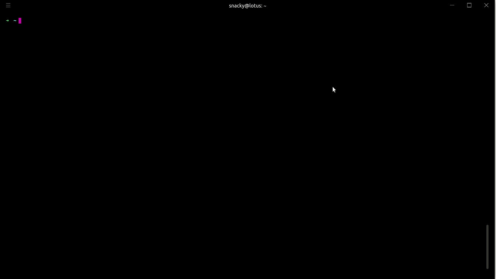

# Hyper

> Hyper는 Electron 기반의 터미널로, HTML/CSS /JS 로 만들어져있다. 그런 이유인지 매우 예쁘고 유려한 디자인을 가지고 있으며, 테마 설치를 통해서 여러가지로 꾸미는 재미를 즐길 수 있다.
>
> 윈도우나 Mac, Linux 모두 지원하며, 물론 버그도 꽤 있는 모양이지만, Linux 환경에 대해서는 별말이 보이지 않으니 사용해 보고 결정하려고 한다. 기본적으로 윈도우의 cmd 보다는 훨씬 예쁘고 보기 편하니 한번쯤 사용해 보는 것도 괜찮을 것 같다. 

- Electon-based Terminal

- Built on HTML/CSS/JS

- Plugins

  

## Hyper 사용 화면 (Ubuntu)

- 아래의 영상은 oh-my-zsh 을 사용하던 환경에서 설치한 것이기 때문에 기본값으로 설치하면 다를 수 있다

  > 화면 전체를 녹화했더니 너무 깨알같이 나온다. 잘 보이지 않는다면 눌러서 확대해서 보면 조금 더 잘 보인다ㅠㅠ
  
  

## 문제점

### 화면 Clear 문제

단순히 windows 에서만 발생하는 문제일수는 있는데, git bash를 사용하던 cmd를 사용하던 화면이 클리어가 되지 않는다. 단순히 터미널 한 페이지 분량만큼만 지워지고 말기 때문에, 오랫동안 클리어없이 사용했다면 한참을 클리어해야 깨끗한 화면을 볼 수 있다.

