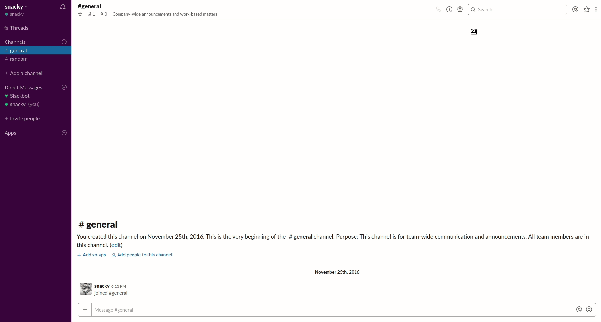

# How to add App for Slack?

> 슬랙(Slack)은 여러가지 App들을 추가하여 연동 가능하다. 대표적으로 Github이나 Jenkins 등을 연동하여 알림을 받는 등이 있을 수 있다. 이러한 App 들을 어떻게 추가할 수 있을까?

### Gihub App 설치 예시

1. Slack 에서 우측 상단에 있는 톱니바퀴 모양의 버튼을 눌러 `Add apps...` 를 누른다.
2. Github 을 키워드로 검색하고, 찾은 App의 `Install` 버튼을 누른다.
3. 홈페이지로 연결되면 다시 `Install` 버튼을 누른다.
4. `Continue` 버튼을 누른다.
5. 원한다면 특정 계정 혹은 채널에서 사용할 수 있도록 추가한다.
6. Slack 에서 추가된 App을 확인할 수 있다.